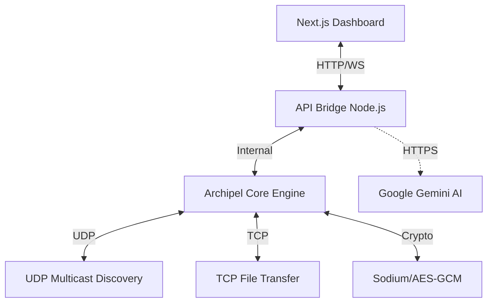

# ARCHIPEL (Hackathon)

**Protocole P2P Chiffré et Décentralisé à Zéro-Connexion**

Ce dépôt contient le prototype développé lors de la 1ère édition du Hackathon "Archipel - The Geek & The Moon".

---

## 🚀 Sprint 0 - Bootstrap & Architecture

### Stack Technologique Choisie
- **Langage principal** : Node.js (JavaScript)
  - Justification: Excellent modèle asynchrone natif, écosystème dense (dgram/net) pour implémenter de la manipulation UDP/TCP de bas niveau rapidement.
- **Transport Local** : 
  - Découverte: UDP Multicast (Port 6000, Adresse 239.255.42.99)
  - Transfert: TCP Sockets (Reliable Data Transfer)
- **Cryptographie** :
  - Identité Nœud & Signature : `libsodium-wrappers` (Ed25519)
  - Intégrité : `crypto` natif (HMAC-SHA256)

### Schéma de l'Architecture (P2P Mesh)

```text
       [ Node A ]  <============ UDP Multicast (HELLO) ===========>  [ Node B ]
      (TCP Port 7777)                                               (TCP Port 7778)
           |                                                              |
           |                  <====== TCP Stream =======>                 |
           |                       (PEER_LIST, DATA)                      |
           |                                                              |
           ▼                                                              ▼
    ┌──────────────┐                                               ┌──────────────┐
    │  API (3001)  │ <─────────── HTTP + WebSocket ──────────────> │  API (3001)  │
    └──────┬───────┘                                               └──────┬───────┘
           │                                                              │
    ┌──────▼───────┐                                               ┌──────▼───────┐
    │ Next.js (UI) │                                               │ Next.js (UI) │
    └──────────────┘                                               └──────────────┘
```

*Aucun serveur central. Chaque Nœud stocke sa liste de pairs et effectue du routage local.*

### Format de Paquet Archipel (Spécification)

Tout message transitant sur le réseau encapsule cette structure binaire stricte :

```text
┌─────────────────────────────────────────────────────────┐
│  ARCHIPEL PACKET v1                                     │
├──────────┬──────────┬───────────┬────────────────────── │
│  MAGIC   │  TYPE    │  NODE_ID  │  PAYLOAD_LEN          │
│  4 bytes │  1 byte  │  32 bytes │  4 bytes (uint32_BE)  │
├──────────┴──────────┴───────────┴────────────────────── │
│  PAYLOAD (variable, encodé ou chiffré selon type)       │
├──────────────────────────────────────────────────────── │
│  HMAC-SHA256 SIGNATURE  (32 bytes)                      │
└─────────────────────────────────────────────────────────┘
```

**Types de Paquets :**
- `0x01 HELLO` : Annonce UDP (Multicast)
- `0x02 PEER_LIST` : Échange de la table de routage (TCP)
- `0x03 MSG` : Message textuel (chiffré E2E - Sprint 2+)
- `0x04 CHUNK_REQ` : Requête de sous-partie de fichier (Sprint 3+)
- `0x05 CHUNK_DATA` : Data d'une sous-partie de fichier (Sprint 3+)
- `0x06 MANIFEST` : Metadatas d'un fichier hébergé sur le réseau
- `0x07 ACK` : Acquittement d'actions

### Démarrage et Test (Sprint 0)
1. Télécharger les dépendances: `npm install`
2. Configurer `.env` avec vos ports libres s'ils entrent en conflit (ex: `TCP_PORT=7777`).
3. Démarrer le Nœud `node src/index.js`.
   Le programme initialisera vos clés et affichera un log garantissant l'encodage/décodage binaire.

---

## 🌐 Sprint 1 - Couche Réseau P2P (Découverte)

Le Sprint 1 a mis en place la véritable infrastructure P2P *Zero-Config*.

### Fonctionnalités Implémentées :
- **Découverte (UDP Multicast)** : Les nœuds broadcastent leur présence (paquet `HELLO`) toutes les 30s. Si un PC rejoint le réseau local, il est immédiatement détecté par les autres, sans serveur central.
- **Table de Routage (PeerTable)** : Chaque nœud maintient une liste en mémoire et sur disque (`.archipel_peertable.json`) des pairs actifs.
- **Routage TCP** : Un serveur TCP écoute les connexions entrantes. Lorsqu'un nouveau pair est découvert, un échange `PEER_LIST` est effectué pour partager les carnets d'adresses.

---

## 🔒 Sprint 2 - Chiffrement E2E et Identité

Le Sprint 2 a ajouté la couche de sécurité, d'authentification et de chiffrement des messages.

### Spécifications Cryptographiques :
- **Identité du Nœud** : Clé publique permanente `Ed25519`.
- **Échange de Clés** : Courbe elliptique `X25519` (ECDH) avec clés éphémères jetables pour chaque session (Perfect Forward Secrecy).
- **Chiffrement Symétrique** : `AES-256-GCM` pour garantir à la fois la confidentialité et l'intégrité (AuthTag) des données transférées.
- **Dérivation de Clé (KDF)** : `HMAC-SHA256` pour dériver la clé de session à partir du secret partagé X25519.

### Le Handshake Archipel (Inspiré de Noise Protocol) :
1. **Alice** envoie sa clé éphémère X25519 (`HELLO`).
2. **Bob** répond avec sa clé éphémère et la signe avec sa clé permanente Ed25519 (`HELLO_REPLY`).
3. Alice et Bob calculent le secret partagé et dérivent une clé `AES-256-GCM`.
4. **Alice** signe la clé de session pour s'authentifier (`AUTH`).
5. **Bob** valide et ouvre le tunnel (`AUTH_OK`).

### Web of Trust (TOFU) :
Les nœuds utilisent le modèle **Trust On First Use** (comme SSH). La première fois qu'ils rencontrent une identité (IP + Clé Publique), ils l'enregistrent dans `.archipel_trust.json`. Lors d'une reconnexion, si la clé publique a changé, le nœud bloque la connexion (Détection *Man-in-the-Middle*).

### Test du Sprint 2 :
```bash
# Lancer le test unitaire du Handshake et de l'algorithme de chiffrement
node test-sprint2.js
2. Configurer `.env` (voir `.env.example`).
3. Démarrer le nœud: `node src/index.js`


---

## Sprint 1 - Couche Réseau P2P (Découverte & Routage)

### Objectif
A la fin du Sprint 1, plusieurs nœuds sur le même réseau local se découvrent automatiquement sans serveur central et s'échangent leurs tables de routage.


### Modules Implémentés

| Fichier | Role |
|---|---|
| `src/protocol/types.js` | Constantes des types de paquets (HELLO, PEER_LIST, etc.) |
| `src/network/peerTable.js` | Table de routage P2P en mémoire + persistance disque (90s timeout) |
| `src/network/discovery.js` | Envoi/réception des HELLO en UDP Multicast (239.255.42.99:6000) toutes les 30s |
| `src/network/tcpServer.js` | Serveur TCP d'écoute, parsing TLV, min. 10 connexions parallèles |
| `src/network/tcpClient.js` | Client TCP pour envoyer les PEER_LIST en unicast |

### Flux de Découverte


Node A (UDP)  --  HELLO (255.42.99:6000)  -->  Node B
Node B        --  TCP PEER_LIST           -->  Node A
Node A        --  TCP PEER_LIST           -->  Node B
[ Les deux ont maintenant l'adresse de l'autre dans leur Peer Table ]

---

## 🚀 Sprint 3 - Chunking & Transfert de Fichiers (BitTorrent-like)

Le Sprint 3 apporte la capacité d'échanger des fichiers volumineux (ex: 50 Mo) de manière fiable, parallèle, et sécurisée.

### Fonctionnalités Principales :
- **Manifeste de Fichier** : Avant le transfert, le fichier est découpé en morceaux virtuels (*chunks* de 512 Ko). Un fichier JSON (le Manifest) est généré avec les hashs SHA-256 globaux et par morceaux, signé par l'émetteur.
- **Téléchargement Parallèle (Pipeline)** : Le receveur ouvre jusqu'à 3 requêtes simultanées pour maximiser la bande passante.
- **Vérification d'Intégrité Stricte** : Chaque chunk reçu est haché en SHA-256 et comparé au Manifest. Un chunk corrompu est rejeté et redemandé.
- **Résilience (Reprise)** : Les chunks validés sont conservés. Le téléchargement reprend automatiquement sur les morceaux manquants dès qu'un pair réapparaît.
- **Réassemblage** : Une fois complet, Archipel régénère le fichier final dans `downloads/` et vérifie son hash final.

---

## 🎨 Sprint 4 - Interface Next.js & IA Gemini

Le Sprint 4 transforme le protocole en une application moderne avec interface visuelle et assistance IA.

### Fonctionnalités Clés :
- **Dashboard Next.js** : Interface "Glassmorphism" sombre pour surveiller le réseau.
- **Live Stream WS** : Mise à jour instantanée des pairs et messages via WebSocket.
- **Intégration Gemini AI** : Assistant intelligent via commande `/ask` ou tag `@archipel-ai`.
- **Mode Offline** : Flag `--no-ai` pour désactiver l'IA proprement.

### Architecture Technique Finale



### Guide de Démo (Pas à pas) :

1. **Préparation** :
   ```bash
   npm install
   cd ui && npm install && npm run build
   cd ..
   ```
2. **Lancement du Nœud (Backend)** : `node src/index.js`
3. **Lancement de l'Interface (Frontend)** : `cd ui && npm run dev`
4. **Utilisation** : Ouvrez `http://localhost:3000`. Testez la découverte, le chat chiffré, l'IA (`/ask ...`), et le partage de fichiers.

---

## 🛠️ Sprint 8 - Audit & Stabilisation (Post-Hackathon)

Suite à un audit technique approfondi, les points suivants ont été stabilisés :
- **Sécurité API** : Protection contre les failles de traversée de chemin (*Path Traversal*) sur les uploads.
- **Identité Persistante** : Les clés Ed25519 sont désormais sauvegardées dans `.archipel_keys.json`.
- **Intégrité Réseau** : Vérification stricte de l'HMAC-SHA256 sur chaque paquet binaire avec `timingSafeEqual`.
- **Optimisation Large Files** : Le ré-assemblage et le hachage final utilisent désormais des **Streams** pour éviter la saturation de la mémoire vive.

### Identité de l'Équipe
- **Team Name** : Archipel Wizards
- **Hackathon** : LBS Hackathon 2026 - Sprint Final.
